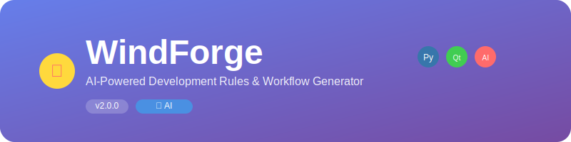

<div align="center">



# 🔥 WindForge

### *The Ultimate AI-Powered Development Rules & Workflow Generator*


---

**🚀 Transform your development workflow with AI-powered rule and workflow generation**

[🎯 Features](#-features) • [📦 Installation](#-installation) • [🔧 Usage](#-usage) • [🤖 AI Integration](#-ai-integration) • [📚 Documentation](#-documentation)

</div>

---

## 🌟 What is WindForge?

**WindForge** is a revolutionary desktop application that combines the power of artificial intelligence with intuitive design to generate comprehensive development rules and workflows. Built with modern PyQt6 and powered by Google's Gemini Flash 2.5, WindForge transforms how development teams create and maintain their coding standards.

## 🎯 Features

<div align="center">



</div>

### 🏆 Core Capabilities

<table>
<tr>
<td width="33%">

#### 🧩 **Rules Generator**
- 📝 **Smart Configuration**
- 🎯 **Category Management** 
- 🔧 **Activation Modes**
- 📁 **Glob Patterns**
- ✅ **Input Validation**
- 👀 **Live Preview**

</td>
<td width="33%">

#### ⚙️ **Workflow Builder**
- 📋 **Step Management**
- 🔄 **Process Design**
- 📊 **Visual Preview**
- 💾 **Auto-save**
- 🎨 **Rich Formatting**
- 📤 **Export Options**

</td>
<td width="33%">

#### 🤖 **AI Generator**
- 🧠 **Gemini Flash 2.5**
- 📊 **Project Analysis**
- 🚀 **Smart Generation**
- 🔍 **Language Detection**
- ⚡ **Batch Processing**
- 🎯 **Context-Aware**

</td>
</tr>
</table>

---

### 🎨 **Modern Interface**

<div align="center">

| Feature | Description | Status |
|---------|-------------|--------|
| 🎨 **macOS-style Icons** | 21 custom SVG icons with gradients | ✅ Complete |
| 📱 **Responsive Design** | Adaptive layout with split views | ✅ Complete |
| 🌙 **Theme Support** | Light/Dark mode ready | 🔄 In Progress |
| ⚡ **Live Preview** | Real-time Markdown rendering | ✅ Complete |
| 🔧 **Settings Panel** | Comprehensive configuration | ✅ Complete |
| 📋 **Copy/Paste Tools** | Enhanced clipboard integration | ✅ Complete |

</div>

## 📦 Installation

<div align="center">

### 🚀 **Quick Start**

</div>

<table>
<tr>
<td width="50%">

#### 🐍 **Prerequisites**
```bash
# Required
Python 3.8+
pip package manager

# Optional (for AI features)
Gemini API Key
```

</td>
<td width="50%">

#### ⚡ **One-Click Setup**
```bash
# Clone repository
git clone https://github.com/windforge/windforge.git
cd windforge

# Install & Run
pip install -r requirements.txt
python main.py
```

</td>
</tr>
</table>

---

### 📋 **Detailed Installation**

<details>
<summary><b>🔧 Step-by-Step Guide</b></summary>

#### 1️⃣ **Download WindForge**
```bash
git clone https://github.com/andalandaloo/windforge.git
cd windforge
```

#### 2️⃣ **Install Dependencies**
```bash
pip install -r requirements.txt
```

#### 3️⃣ **Setup AI Generator** *(Optional)*
```bash
# Windows - Automated setup
setup_ai.bat

# Manual installation
pip install protobuf==4.25.1
pip install google-generativeai==0.3.2

# If you encounter issues, use the fix script
fix_installation.bat
```

#### 4️⃣ **Configure API Key** *(Optional)*
- 🔑 Get your key from [Google AI Studio](https://makersuite.google.com/app/apikey)
- 🌍 Set environment variable: `set GEMINI_API_KEY=your_key`
- ⚙️ Or configure in application settings

#### 5️⃣ **Launch Application**
```bash
python main.py
```

</details>

---

### 🐳 **Docker Installation** *(Coming Soon)*

```dockerfile
# Pull and run WindForge
docker pull andalandaloo/windforge:latest
docker run -p 8080:8080 andalandaloo/windforge
```

---

### 🚨 **Installation Issues?**

<details>
<summary><b>🔧 Quick Fixes</b></summary>

#### ❌ **"Metaclasses with custom tp_new are not supported"**
```bash
# Run automated fix
fix_installation.bat

# Or manual fix
pip uninstall -y google-generativeai protobuf
pip install protobuf==4.25.1
pip install google-generativeai==0.3.2
```

#### ❌ **AI Tab Missing**
This is normal! WindForge works without AI features.
```bash
# To enable AI features
setup_ai.bat
```

#### ❌ **Import Errors**
```bash
# Use minimal installation
pip install -r requirements-minimal.txt
python main.py  # Works without AI
```

📋 **[Full Troubleshooting Guide](TROUBLESHOOTING.md)**

</details>

## 🏗️ Architecture

<div align="center">

### 📊 **Project Structure**



</div>

---

### 📂 **Directory Layout**

<details>
<summary><b>🗂️ Detailed File Structure</b></summary>

```
🔥 WindForge/
├── 🚀 main.py                    # Application entry point
├── 🎨 icon_showcase.py          # Icon gallery utility
│
├── 🧠 core/                      # Business logic layer
│   ├── 🏭 generators/           # Content generation engines
│   │   ├── 📋 rules_generator.py     # Rule creation engine
│   │   ├── ⚙️ workflows_generator.py # Workflow builder
│   │   ├── 🤖 ai_generator.py        # AI-powered generation
│   │   └── 📦 __init__.py            # Module exports
│   ├── 🛠️ utils/                # Utility toolkit
│   │   ├── 📁 file_utils.py          # File operations
│   │   ├── ⚙️ config_utils.py        # Configuration helpers
│   │   ├── ✅ validator.py           # Input validation
│   │   └── 📦 __init__.py            # Module exports
│   └── 🔧 config_manager.py     # Settings management
│
├── 🎨 ui/                        # User interface components
│   ├── ⚙️ settings_dialog.py     # Configuration panel
│   ├── 🤖 ai_tab.py              # AI generation interface
│   └── 📦 __init__.py           # Module exports
│
├── 🎭 resources/                 # Static assets
│   └── 🎨 icons/                # Icon collection (21 SVG files)
│       ├── 🔥 app_icon.svg      # Main application icon
│       ├── 🧩 rules_tab.svg     # Rules tab icon
│       ├── ⚙️ workflow_tab.svg  # Workflow tab icon
│       ├── 🤖 ai_icon.svg       # AI generator icon
│       └── 🎨 ... (17 more)     # Additional UI icons
│
├── ⚙️ config/                    # Configuration files
│   └── 📄 settings.json         # Application preferences
│
├── 📋 requirements.txt          # Python dependencies
├── 🚀 run.bat                   # Windows launcher
├── ⚙️ setup_ai.bat             # AI setup script
└── 📚 README.md                # Documentation
```

</details>

## 🔧 Usage

<div align="center">

### 🎯 **Three Ways to Generate Content**

</div>

<table>
<tr>
<td width="33%">

### 🧩 **Manual Rules**


</td>
<td width="33%">

### ⚙️ **Manual Workflows**


</td>
<td width="33%">

### 🤖 **AI Generation**


</td>
</tr>
</table>

---

### 📋 **Step-by-Step Guides**

<details>
<summary><b>🧩 Creating Rules Manually</b></summary>

#### 🎯 **Rules Generator Workflow**

1. **🚀 Launch WindForge**
   ```bash
   python main.py
   ```

2. **📝 Open Rules Tab**
   - Click on "🧩 Rules Generator" tab

3. **⚙️ Configure Rule**
   - **Title**: Enter descriptive rule name
   - **Category**: Choose from dropdown (UI, Database, Logic, Security, etc.)
   - **Activation**: Select mode (Always On, Manual, Glob)
   - **Glob Pattern**: Add file matching pattern (e.g., `**/*.py`)
   - **Description**: Write rule purpose
   - **Rules**: List specific rules (one per line)

4. **📁 Set Output**
   - Choose destination folder
   - Default: `.windsurf/rules/`

5. **🚀 Generate & Preview**
   - Click "Generate Rule" button
   - Review in live preview panel
   - Copy or clear as needed

</details>

<details>
<summary><b>⚙️ Creating Workflows Manually</b></summary>

#### 🔄 **Workflow Builder Process**

1. **📋 Open Workflow Tab**
   - Click on "⚙️ Workflow Generator" tab

2. **📝 Configure Workflow**
   - **Title**: Enter workflow name
   - **Description**: Explain workflow purpose
   - **Steps**: List process steps (numbered automatically)

3. **📁 Set Output Location**
   - Choose destination folder
   - Default: `.windsurf/workflows/`

4. **🚀 Generate & Review**
   - Click "Generate Workflow" button
   - Preview generated Markdown
   - Save when satisfied

</details>

<details>
<summary><b>🤖 AI-Powered Generation</b></summary>

#### 🧠 **Smart AI Workflow**

1. **🔑 Setup API Key**
   - Get key from [Google AI Studio](https://makersuite.google.com/app/apikey)
   - Enter in AI tab or set environment variable:
     ```bash
     set GEMINI_API_KEY=your_api_key_here
     ```

2. **🤖 Open AI Generator**
   - Click on "🤖 AI Generator" tab
   - Verify AI status shows "Ready"

3. **💡 Describe Your Project**
   - Enter detailed project description
   - Include technologies, goals, and context

4. **📁 Select Project Folder**
   - Choose your project directory
   - AI will analyze structure and languages

5. **⚙️ Configure Generation**
   - ✅ Generate Rules (recommended)
   - ✅ Generate Workflows (recommended)
   - Set maximum items per type

6. **🚀 Generate with AI**
   - Click "🤖 Generate with AI"
   - Wait for AI analysis and generation
   - Monitor progress in status bar

7. **📊 Review Results**
   - Check "Generated Rules" tab
   - Review "Generated Workflows" tab
   - Edit or regenerate if needed

8. **💾 Save Generated Content**
   - Use "Save All Rules" button
   - Use "Save All Workflows" button
   - Files saved to configured output folders

</details>

## 🤖 AI Integration

<div align="center">

### 🧠 **Powered by Gemini Flash 2.5**

</div>

<table>
<tr>
<td width="50%">

#### 🔍 **Project Analysis**
- 📊 **Language Detection**: Automatic identification of programming languages
- 🏗️ **Framework Recognition**: Detects popular frameworks and libraries
- 📁 **Structure Analysis**: Understands project organization
- 📈 **Complexity Assessment**: Evaluates project size and scope

</td>
<td width="50%">

#### 🚀 **Smart Generation**
- 🎯 **Context-Aware**: Rules tailored to your specific project
- 🔄 **Batch Processing**: Multiple rules and workflows at once
- 🌐 **Multi-Language**: Supports 15+ programming languages
- ⚡ **Fast Processing**: Optimized for quick generation

</td>
</tr>
</table>

---

### 📊 **AI Capabilities**


---

## 📝 Generated Examples

<details>
<summary><b>🧩 Sample Rule Output</b></summary>

### 🎯 **AI-Generated Rule**
```markdown
# UI Component Validation

**Category:** UI
**Activation mode:** Always On
**Glob pattern:** **/*.tsx

**Description:** Validation rules for React components

**Rules:**
- All components must have PropTypes defined
- Components should use TypeScript interfaces
- Avoid inline styles, use CSS modules
- Implement proper error boundaries
- Use semantic HTML elements

_Generated on 2024-01-15 14:30_
```

</details>

<details>
<summary><b>⚙️ Sample Workflow Output</b></summary>

### 🔄 **AI-Generated Workflow**
```markdown
# Component Development Workflow

**Description:** Standard workflow for developing new React components

**Steps:**
1. Create component directory structure
2. Define TypeScript interfaces
3. Implement component logic
4. Add unit tests with Jest
5. Create Storybook stories
6. Update documentation
7. Run accessibility tests
8. Submit for code review

_Generated on 2024-01-15 14:35_
```

</details>

## ⚙️ Configuration

<div align="center">

### 🔧 **Customization Options**

</div>

<table>
<tr>
<td width="50%">

#### 📁 **Path Settings**
```json
{
  "default_paths": {
    "rules": ".windsurf/rules",
    "workflows": ".windsurf/workflows"
  }
}
```

#### 🎨 **UI Preferences**
```json
{
  "ui_settings": {
    "window_width": 1200,
    "window_height": 800,
    "theme": "light"
  }
}
```

</td>
<td width="50%">

#### 📋 **Categories**
```json
{
  "categories": [
    "UI", "Database", "Logic",
    "Security", "Performance",
    "Testing", "Documentation"
  ]
}
```

#### ⚙️ **Activation Modes**
```json
{
  "activation_modes": [
    "Always On",
    "Manual", 
    "Glob"
  ]
}
```

</td>
</tr>
</table>

---

## 🛠️ Development

<div align="center">

### 👨‍💻 **Contributing to WindForge**

[](https://github.com/windforge/windforge/graphs/contributors)
[](https://github.com/windforge/windforge/issues)
[](https://github.com/windforge/windforge/pulls)

</div>

### 🚀 **Getting Started**

<details>
<summary><b>🔧 Development Setup</b></summary>

#### 1️⃣ **Fork & Clone**
```bash
git clone https://github.com/andalandaloo/windforge.git
cd windforge
```

#### 2️⃣ **Create Virtual Environment**
```bash
python -m venv windforge-env
source windforge-env/bin/activate  # Linux/Mac
windforge-env\Scripts\activate     # Windows
```

#### 3️⃣ **Install Dependencies**
```bash
pip install -r requirements.txt
pip install -r requirements-dev.txt  # Development dependencies
```

#### 4️⃣ **Run Tests**
```bash
pytest tests/
```

</details>

### 📋 **Development Guidelines**

<table>
<tr>
<td width="50%">

#### 🎯 **Code Standards**
- ✅ Follow PEP 8 guidelines
- ✅ Use type hints
- ✅ Add comprehensive docstrings
- ✅ Maintain test coverage >80%
- ✅ Use meaningful commit messages

</td>
<td width="50%">

#### 🏗️ **Architecture Principles**
- 🔄 Separation of concerns
- 📦 Modular design
- 🧪 Testable components
- 📚 Clear documentation
- 🔒 Secure by default

</td>
</tr>
</table>

### 🎨 **Adding New Features**



---

## 🐛 Troubleshooting

<div align="center">

### 🔍 **Common Issues & Solutions**

</div>

<details>
<summary><b>🐍 Python & Dependencies</b></summary>

#### ❌ **PyQt6 Installation Error**
```bash
# Solution 1: Upgrade pip
pip install --upgrade pip
pip install PyQt6

# Solution 2: Use conda
conda install pyqt

# Solution 3: System-specific
# Ubuntu/Debian
sudo apt-get install python3-pyqt6

# macOS
brew install pyqt6
```

#### ❌ **Gemini API Issues**
```bash
# Check API key
echo $GEMINI_API_KEY

# Test connection
python -c "import google.generativeai as genai; print('✅ Gemini available')"

# Reinstall if needed
pip uninstall google-generativeai
pip install google-generativeai
```

</details>

<details>
<summary><b>🔐 Permissions & Access</b></summary>

#### ❌ **Permission Denied**
- **Windows**: Run as Administrator
- **Linux/Mac**: Check folder permissions
  ```bash
  chmod 755 .windsurf/
  chmod 644 .windsurf/rules/*
  ```

#### ❌ **File Not Found**
- Verify output directories exist
- Check file paths in settings
- Ensure write permissions

</details>

<details>
<summary><b>🎨 UI & Display Issues</b></summary>

#### ❌ **Icons Not Displaying**
- Check `resources/icons/` folder exists
- Verify SVG files are present
- Try running icon showcase: `python icon_showcase.py`

#### ❌ **Window Size Issues**
- Reset settings: Delete `config/settings.json`
- Manually edit window dimensions in settings
- Use Settings dialog to adjust

</details>

## 🎨 Icons & Design

<div align="center">

### 🎭 **21 Custom SVG Icons**

[](resources/icons/)
[](resources/icons/)

</div>

<table>
<tr>
<td width="25%">

#### 📱 **App Icons**
- 🔥 Main (512x512)
- 📱 Medium (64x64)  
- 🔸 Small (32x32)

</td>
<td width="25%">

#### 🧩 **Tab Icons**
- 📋 Rules Generator
- ⚙️ Workflow Builder
- 🤖 AI Generator

</td>
<td width="25%">

#### 🔧 **Function Icons**
- 🚀 Generate Button
- 📁 Folder Browser
- 👁️ Preview Panel
- 📝 Markdown File

</td>
<td width="25%">

#### ✅ **Status Icons**
- ✅ Success State
- ❌ Error State  
- ⚠️ Validation Warning
- 🔄 Refresh Action

</td>
</tr>
</table>

### 🎨 **Design Philosophy**



### 🎨 **Apple-Style Theme System**

WindForge uses **Qt Style Sheets (QSS)** for theming, providing a native Apple-inspired design:

- **🎯 QSS Format**: Proper Qt styling with full compatibility
- **🍎 Apple Design**: Colors, typography, and spacing matching Apple's guidelines
- **⚡ Performance**: Optimized loading and rendering
- **🔧 Maintainable**: Separate theme files for easy customization

```bash
# Theme files location
resources/styles/apple_theme.qss

# Theme loading system
core/theme_loader.py
```

### 🔧 **Icon Showcase**
```bash
# Preview all icons
python icon_showcase.py

# View icon documentation
cat resources/icons/README.md
```

---

## 🚀 Roadmap

<div align="center">

### 🛣️ **Future Enhancements**

</div>

| Feature | Status | Priority | ETA |
|---------|--------|----------|-----|
| 🌙 **Dark Mode** | 🔄 In Progress | High | Q1 2024 |
| 🌐 **GitHub Integration** | 📋 Planned | High | Q2 2024 |
| 🐳 **Docker Support** | 📋 Planned | Medium | Q2 2024 |
| 🌍 **Multi-language UI** | 💡 Idea | Low | Q3 2024 |
| 📱 **Web Version** | 💡 Idea | Medium | Q4 2024 |
| 🔌 **Plugin System** | 💡 Idea | Low | 2025 |

---

## 📚 Documentation

<div align="center">

### 📖 **Learn More**

[](docs/)
[](https://github.com/windforge/windforge/wiki)
[](docs/api/)

</div>

- 📋 **[User Guide](docs/user-guide.md)** - Complete usage documentation
- 🔧 **[Developer Guide](docs/developer-guide.md)** - Contributing and development
- 🎨 **[Design System](docs/design-system.md)** - UI/UX guidelines
- 🤖 **[AI Integration](docs/ai-integration.md)** - Gemini API setup and usage

---

## 🤝 Community

<div align="center">

### 👥 **Join the WindForge Community**

[](https://discord.gg/windforge)
[](https://twitter.com/windforge_dev)
[](https://linkedin.com/company/windforge)

</div>

### 🎯 **Ways to Contribute**

<table>
<tr>
<td width="33%">

#### 💻 **Code**
- 🐛 Fix bugs
- ✨ Add features  
- 🧪 Write tests
- 📚 Improve docs

</td>
<td width="33%">

#### 🎨 **Design**
- 🎭 Create icons
- 🎨 UI/UX improvements
- 📱 Responsive design
- 🌙 Dark mode themes

</td>
<td width="33%">

#### 📢 **Community**
- 🐛 Report issues
- 💡 Suggest features
- 📖 Write tutorials
- 🌍 Translate UI

</td>
</tr>
</table>

---

## 📄 License

<div align="center">

**WindForge** is open source software licensed under the **MIT License**.

[](https://opensource.org/licenses/MIT)

```
MIT License - see LICENSE file for details
Copyright (c) 2024 WindForge Contributors
```

</div>

---

## 🙏 Acknowledgments

<div align="center">

### 💝 **Special Thanks**

</div>

- 🧠 **Google** - For the amazing Gemini Flash 2.5 AI model
- 🐍 **Python Community** - For the incredible ecosystem
- 🎨 **Qt Project** - For the powerful PyQt6 framework
- 🌟 **Contributors** - For making WindForge better every day

---

<div align="center">

### 🔥 **WindForge**

*Forging the future of development workflows with AI*

**[⭐ Star us on GitHub](https://github.com/andalandaloo/windforge)** • **[🐛 Report Issues](https://github.com/andalandaloo/windforge/issues)** • **[💡 Request Features](https://github.com/andalandaloo/windforge/discussions)**

---

Made with ❤️ by andalandaloo

</div>
